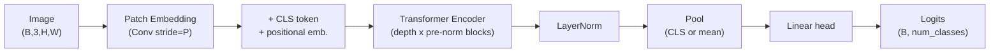

# Build Your Own ViT

A **production-grade Vision Transformer (ViT)** implemented from scratch in
PyTorch — with a clean, from-first-principles model, a full training engine, a
hardened FastAPI inference service, ONNX export, a typed CLI, Docker/Kubernetes
deployment, and a test suite exceeding **95% coverage**.

This repository is both an **educational reference** (every layer is written out
and documented) and a **deployable system** (mixed precision, EMA, Mixup/CutMix,
Prometheus metrics, rate limiting, health probes, CI/CD).

> Paper: *An Image Is Worth 16x16 Words: Transformers for Image Recognition at
> Scale* — Dosovitskiy et al., 2021 ([arXiv:2010.11929](https://arxiv.org/abs/2010.11929)).

---

## Table of contents

- [Why this exists](#why-this-exists)
- [Features](#features)
- [Architecture at a glance](#architecture-at-a-glance)
- [Quick start](#quick-start)
- [The `vit` CLI](#the-vit-cli)
- [Configuration](#configuration)
- [Training](#training)
- [Inference & serving](#inference--serving)
- [Project layout](#project-layout)
- [Development](#development)
- [Documentation](#documentation)
- [License](#license)

---

## Why this exists

Most ViT repos are either (a) a single teaching notebook with no path to
production, or (b) a heavyweight framework where the model is buried under
abstractions. This project keeps the model **fully visible** — patch embedding,
multi-head attention, and the encoder are ~40 lines each — while wrapping it in
the operational scaffolding a real service needs.

## Features

| Area            | What you get |
|-----------------|--------------|
| **Model**       | From-scratch ViT: patch embed, MHSA (fused SDPA + interpretable path), pre-norm encoder, stochastic depth, CLS/mean pooling, attention-map extraction. Presets: Tiny/Small/Base/Large with verified parameter counts. |
| **Training**    | AdamW with correct no-decay grouping, cosine schedule + warmup, AMP (fp16/bf16), gradient accumulation & clipping, Mixup/CutMix, label smoothing, EMA, early stopping, atomic self-describing checkpoints. |
| **Data**        | CIFAR-10/100, ImageFolder, and a synthetic `fake` backend for tests. RandAugment, reproducible splits. |
| **Inference**   | `Predictor` that rebuilds the model straight from a checkpoint; ONNX export with dynamic batch. |
| **Serving**     | FastAPI app: `/healthz`, `/readyz`, `/v1/predict`, `/v1/metadata`, `/metrics`. Security headers, per-IP rate limiting, bearer auth, upload validation, structured JSON logs. |
| **DevOps**      | Multi-stage non-root Dockerfile, docker-compose, Kubernetes manifests (HPA, PDB, probes), GitHub Actions CI (lint + type-check + test matrix + image smoke test) and release pipeline. |
| **Quality**     | Ruff + Mypy (typed, `py.typed`), Pytest, **96%+** coverage, pre-commit hooks. |

## Architecture at a glance



A deeper treatment — component, sequence, and deployment diagrams — lives in
[`docs/architecture.md`](docs/architecture.md).

## Quick start

Requires Python >= 3.10.

```bash
# 1. Install (editable, with serve + export + dev extras)
python -m pip install -e ".[all]"

# 2. Sanity check the environment
vit info

# 3. Fast synthetic smoke run (no download, a few steps) — proves the pipeline
vit train --config configs/vit_tiny_cifar10.yaml --smoke

# 4. Real training on CIFAR-10 (auto-downloads the dataset)
vit train --config configs/vit_tiny_cifar10.yaml

# 5. Classify an image with the best checkpoint
vit predict --checkpoint outputs/vit_tiny_cifar10/best.pt --image cat.png --top-k 5

# 6. Serve it
vit serve --checkpoint outputs/vit_tiny_cifar10/best.pt --port 8080
curl -F "file=@cat.png" "http://localhost:8080/v1/predict?top_k=5"
```

### Use the model as a library

```python
import torch
from vit import build_model, ModelConfig

cfg = ModelConfig.from_preset("vit_tiny", num_classes=10, image_size=32, patch_size=4)
model = build_model(cfg)
logits = model(torch.randn(1, 3, 32, 32))     # (1, 10)
attn   = model.get_attention_maps(torch.randn(1, 3, 32, 32))  # per-layer maps
print(model.num_parameters)                    # 5362762
```

## The `vit` CLI

| Command        | Purpose |
|----------------|---------|
| `vit info`     | Print version, torch/CUDA status, resolved device, presets. |
| `vit init-config` | Scaffold a YAML config from a preset. |
| `vit train`    | Train from a config (`--smoke`, `--resume`, `--set k=v`, `--epochs`, `--device`). |
| `vit evaluate` | Evaluate a checkpoint on `val`/`test`. |
| `vit predict`  | Classify an image (`--top-k`, `--no-ema`). |
| `vit export`   | Export a checkpoint to ONNX. |
| `vit serve`    | Launch the FastAPI inference server. |

Run `vit <command> --help` for the full flag list.

## Configuration

Everything is driven by a single validated `Config` (Pydantic v2), mirrored by
the YAML files under [`configs/`](configs/). Sections: `model`, `data`, `optim`,
`scheduler`, `train`. Invalid combinations (e.g. `patch_size` not dividing
`image_size`, or a `num_classes` that disagrees with the dataset) fail fast with
a precise message. See [`docs/training.md`](docs/training.md) for every field.

Override any field on the command line without editing files:

```bash
vit train -c configs/vit_tiny_cifar10.yaml --set train.epochs=50 optim.lr=5e-4
```

## Training

The [`Trainer`](src/vit/training/trainer.py) is framework-light and fully
auditable. Highlights: mixed precision, gradient accumulation, EMA weights used
for validation/serving, and atomic checkpoints that embed the model config and
preprocessing so inference is self-contained. Reference recipes:

| Config | Dataset | Model | Notes |
|--------|---------|-------|-------|
| `configs/vit_tiny_cifar10.yaml`   | CIFAR-10  | ViT-Tiny  | ~90%+ top-1 from scratch. |
| `configs/vit_small_cifar100.yaml` | CIFAR-100 | ViT-Small | Stronger augmentation. |
| `configs/vit_base_imagenet.yaml`  | ImageFolder | ViT-Base/16 | Multi-GPU ImageNet-style. |

## Inference & serving

The API is documented in full in [`docs/api.md`](docs/api.md) and self-documents
at `/docs` (Swagger) when running. Key endpoints:

- `GET /healthz` — liveness (always 200 while the process is up).
- `GET /readyz` — readiness (503 until a model is loaded).
- `POST /v1/predict` — multipart image upload -> ranked predictions.
- `GET /v1/metadata` — classes, image size, device.
- `GET /metrics` — Prometheus exposition.

```bash
docker compose up --build          # API on :8080, Prometheus on :9090
```

## Project layout

```
build-your-own-vit/
├── src/vit/               # The installable package
│   ├── models/            # PatchEmbedding, Attention, MLP, Encoder, ViT, factory
│   ├── data/              # DataModule + transforms
│   ├── training/          # Trainer, optim, scheduler, mixup, ema, metrics
│   ├── inference/         # Predictor, ONNX export
│   ├── serving/           # FastAPI app, service, middleware, metrics, settings
│   ├── utils/             # logging, seed, device, checkpoint
│   ├── config.py          # Pydantic config schema + YAML loading
│   └── cli.py             # `vit` entry point
├── tests/                 # Pytest suite (96%+ coverage)
├── configs/               # YAML training recipes
├── deploy/                # Prometheus, Kubernetes manifests
├── docs/                  # Architecture, API, training, deployment, security, ...
├── .github/workflows/     # CI + release pipelines
├── Dockerfile, docker-compose.yml, Makefile, pyproject.toml
```

## Development

```bash
make install     # editable install with all extras
make hooks       # install pre-commit hooks
make check       # ruff + mypy + pytest (the CI gate)
make cov-html    # HTML coverage report
```

See [`CONTRIBUTING.md`](CONTRIBUTING.md).

## Documentation

| Doc | Contents |
|-----|----------|
| [architecture.md](docs/architecture.md) | System & model design, diagrams, rationale, scalability, reliability. |
| [api.md](docs/api.md)                    | REST reference, auth, errors, examples, OpenAPI. |
| [training.md](docs/training.md)          | Config reference, recipes, tuning, reproducibility. |
| [deployment.md](docs/deployment.md)      | Docker, Kubernetes, autoscaling, rollback. |
| [security.md](docs/security.md)          | Threat model, OWASP mapping, secrets, supply chain. |
| [operations.md](docs/operations.md)      | Runbook: monitoring, alerts, incident response. |
| [troubleshooting.md](docs/troubleshooting.md) | Common failures and fixes. |

## License

Apache-2.0 — see [`LICENSE`](LICENSE).
