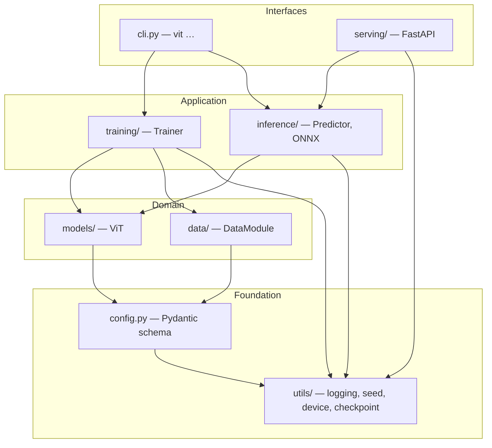
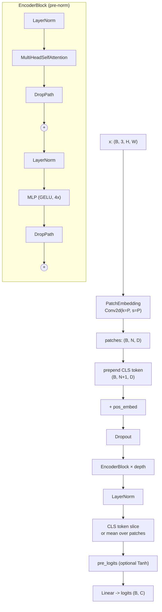
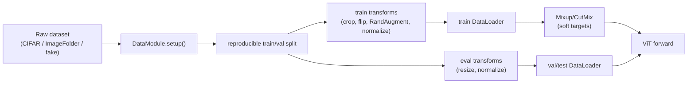
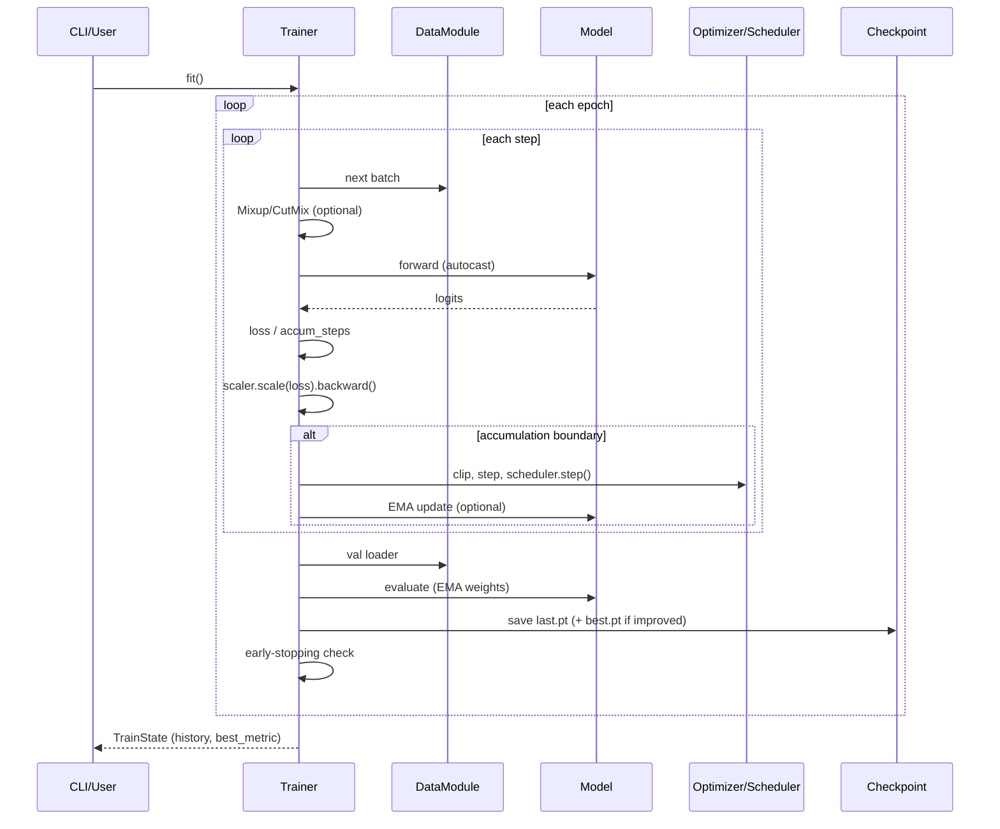
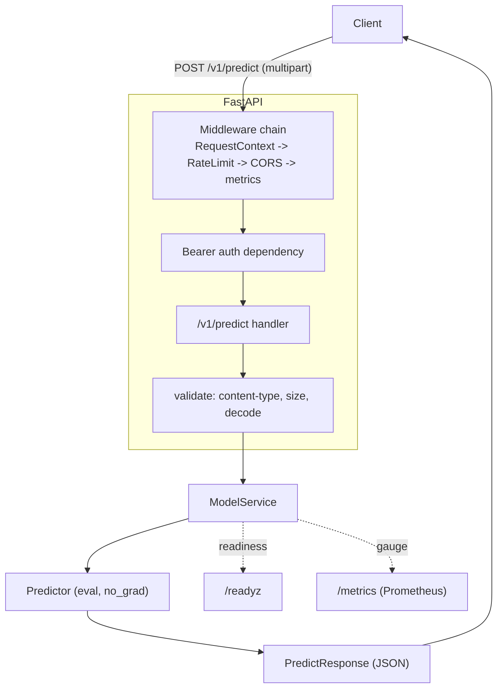
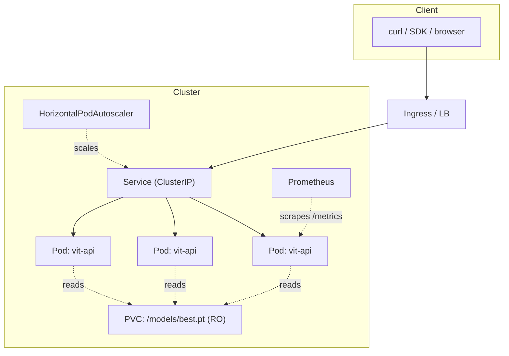

# Architecture

This document explains the system design of **Build Your Own ViT** from the top
down: the model, the training engine, the serving layer, and how they deploy.
It assumes no prior familiarity with the codebase.

- [1. High-level system](#1-high-level-system)
- [2. Model architecture](#2-model-architecture)
- [3. Data flow](#3-data-flow)
- [4. Training sequence](#4-training-sequence)
- [5. Serving architecture](#5-serving-architecture)
- [6. Deployment architecture](#6-deployment-architecture)
- [7. Design rationale & trade-offs](#7-design-rationale--trade-offs)
- [8. Scalability & performance](#8-scalability--performance)
- [9. Reliability, fault tolerance & DR](#9-reliability-fault-tolerance--disaster-recovery)
- [10. Cost optimization](#10-cost-optimization)
- [11. Future extensibility](#11-future-extensibility)

---

## 1. High-level system

The repository is a single Python package (`vit`) with clearly separated layers.
Dependencies point **inward**: `serving` and `cli` depend on `inference`/
`training`, which depend on `models`/`data`, which depend on `config`/`utils`.
Nothing low-level imports anything high-level, so the model can be used with no
FastAPI, Trainer, or CLI in scope (Clean Architecture / dependency-inversion).

| Layer | Modules | Responsibility |
|-------|---------|----------------|
| Foundation | `config.py`, `utils/` | Validated configuration; logging, seeding, device selection, checkpoint I/O. |
| Domain | `models/`, `data/` | The ViT network and the dataset/DataLoader machinery. |
| Application | `training/`, `inference/` | Orchestrate the domain to train models and to serve predictions. |
| Interfaces | `cli.py`, `serving/` | Human/HTTP entry points. |

## 2. Model architecture

The Vision Transformer turns an image into a sequence of patch tokens and
applies a standard Transformer encoder. Low-level module breakdown:

### Key modules

| Module | File | Notes |
|--------|------|-------|
| `PatchEmbedding` | `models/patch_embedding.py` | A strided `Conv2d` *is* the per-patch linear projection. Output `(B, N, D)`. |
| `MultiHeadSelfAttention` | `models/attention.py` | Fused `scaled_dot_product_attention` fast path; manual path returns head-averaged weights for visualization. |
| `MLP` | `models/mlp.py` | Two linears + GELU; hidden width `mlp_ratio × D`. |
| `DropPath` | `models/drop_path.py` | Stochastic depth; per-sample residual drop with inverted-dropout scaling. |
| `EncoderBlock` / `TransformerEncoder` | `models/encoder.py` | Pre-norm residual block; depth-wise linear drop-path ramp. |
| `VisionTransformer` | `models/vit.py` | Assembles the above; `from_config`, `forward_features`, `get_attention_maps`. |

### Verified parameter counts (image 224, patch 16, 1000 classes)

| Preset | embed_dim | depth | heads | Params |
|--------|-----------|-------|-------|--------|
| `vit_tiny`  | 192  | 12 | 3  | ~5.7M |
| `vit_small` | 384  | 12 | 6  | ~22M  |
| `vit_base`  | 768  | 12 | 12 | ~86M  |
| `vit_large` | 1024 | 24 | 16 | ~304M |

These match the reference implementations (a regression test asserts within 3%).

## 3. Data flow

The **same normalization statistics** used in training are written into the
checkpoint (`preprocess`) so the `Predictor` reconstructs an identical eval
pipeline at serving time — eliminating train/serve skew.

## 4. Training sequence

## 5. Serving architecture

The **liveness/readiness split** is deliberate: `/healthz` returns 200 as soon
as the process is up (so the orchestrator does not kill a slow-starting pod),
while `/readyz` stays 503 until `ModelService.load()` succeeds (so traffic is
only routed to pods that can actually serve). Model loading never raises — a
load failure is recorded and surfaced via `/readyz`.

## 6. Deployment architecture

Each replica is **stateless** and loads the read-only checkpoint at startup;
scaling out is purely horizontal. See [deployment.md](deployment.md).

## 7. Design rationale & trade-offs

| Decision | Chosen | Alternatives | Why |
|----------|--------|--------------|-----|
| Framework | **PyTorch** | JAX/Flax, TF | Ubiquity, ecosystem, readable eager code. |
| ViT from scratch | **Yes** | `timm` | Educational transparency; no hidden behavior. |
| Attention | **Fused SDPA + manual path** | Manual only | Flash/mem-efficient kernels for speed; manual path preserves interpretability. |
| No `einops` | **Pure tensor ops** | einops | One fewer dep; explicit reshapes are teachable. |
| Config | **Pydantic v2** | argparse-only, Hydra | Validation + JSON Schema + one source of truth; lighter than Hydra. |
| Trainer | **Hand-written loop** | Lightning, Accelerate | Full visibility of the training step; no framework lock-in. |
| Serving | **FastAPI** | Flask, Triton, TorchServe | Async, typed, auto OpenAPI; Triton/TorchServe are heavier and opaque for a reference. |
| Checkpoint | **Self-describing dict** | weights-only | Inference needs zero external metadata; atomic writes prevent corruption. |
| CLI | **argparse** | Typer/Click | Zero extra deps in the core. |

## 8. Scalability & performance

- **Training throughput**: AMP (fp16/bf16) via `torch.autocast`, fused
  attention kernels, `num_workers` + pinned memory + persistent workers,
  optional `torch.compile`, and gradient accumulation to reach large effective
  batch sizes on limited memory.
- **Distributed training**: the loop is DDP-ready — wrap the model in
  `DistributedDataParallel`, add a `DistributedSampler`, and guard rank-0-only
  logging/checkpointing. The no-decay grouping and per-step schedule are already
  DDP-safe.
- **Inference latency**: `no_grad` + eval mode; EMA weights; thread pinning for
  CPU containers (`VIT_NUM_THREADS`); ONNX export for ONNX Runtime/TensorRT.
- **Horizontal scale (serving)**: stateless replicas behind a Service, driven by
  an HPA on CPU utilization (extendable to a custom latency metric).

## 9. Reliability, fault tolerance & disaster recovery

- **Atomic checkpoints**: write-to-temp-then-rename means an interrupted save
  never corrupts the previous good checkpoint. `best.pt` and `last.pt` give both
  "best metric" and "latest for resume".
- **Resumable training**: full optimizer/scheduler/scaler/EMA/epoch state is
  persisted; `Trainer.resume()` continues exactly.
- **Graceful serving degradation**: model load failures do not crash the
  process; the pod reports not-ready and the orchestrator withholds traffic.
- **Probes & PDB**: liveness/readiness probes plus a PodDisruptionBudget keep a
  quorum available during rollouts and node drains.
- **DR**: checkpoints are the only stateful artifact — back them up to object
  storage (versioned bucket). Recovery is "point a new deployment at the bucket".

## 10. Cost optimization

- CPU-only inference image by default (no CUDA layers) → smaller images, cheaper
  nodes for latency-tolerant workloads.
- Right-sized requests/limits and HPA scale-to-need; PDB avoids over-provisioning
  for availability.
- bf16/fp16 training cuts GPU-hours; EMA often reaches target accuracy in fewer
  epochs.
- Docker layer caching + GHA cache keep CI minutes down.

## 11. Future extensibility

The seams are explicit:

- **New architectures**: add a preset to `config.PRESETS`, or subclass
  `VisionTransformer` (e.g. register tokens, SwiGLU MLP, rotary/relative pos).
- **New datasets**: extend `DataModule._setup_*` and the `dataset` Literal.
- **New optimizers/schedulers**: add a branch in `training/optim.py` /
  `training/scheduler.py`.
- **New serving backends**: implement an ONNX Runtime `Predictor` behind the
  same `ModelService` interface.
- **Distillation / SSL**: the encoder and `forward_features` are ready to be
  reused as a backbone (DeiT distillation token, MAE decoder, etc.).
